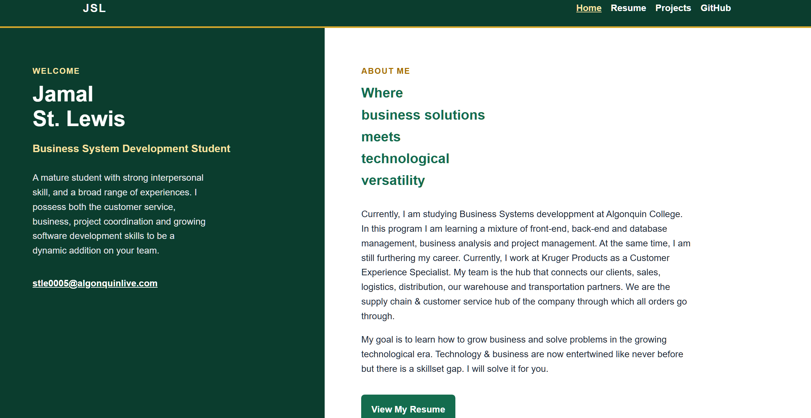
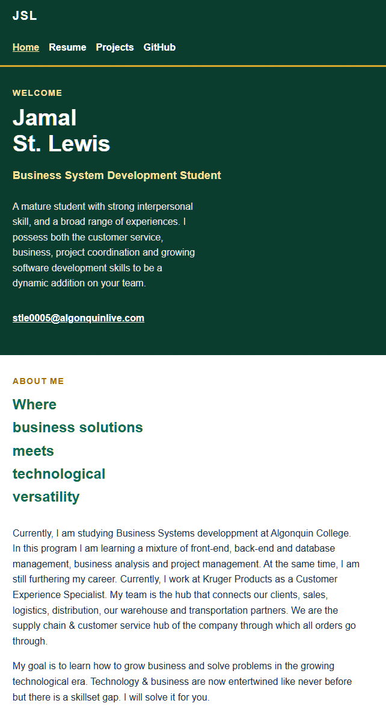
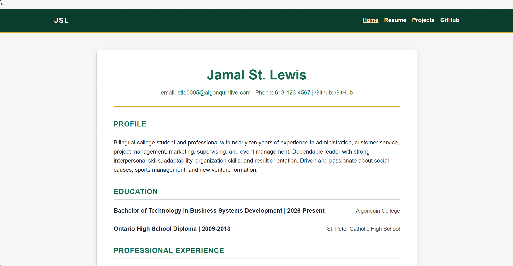
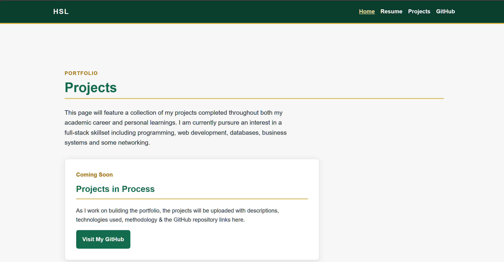

#Jamal St Lewis Portfolio Design System
## Purpose
This is for the design system for CST3106 portfolio website.

There are three pages:
1. Homepage
2. Resume Page
3. Projects Page

The goal is to create a modern & professional personal portfolio. It should be easily legible and higlight my
business & technology skills from my Bachelor of Technology - Business System Development program.

##Portfolio Repository

The actual portfolio should be available in the repository below:
 [Portfolio-Project](https://github.com/GauisCode/Portfolio-Project)

 ## Design Concept
-I attempted to do a split "hero" layout where the left side is static and the right side you can scroll.
-The colour pallet is a forest green with a gold accent.
=The left side has an about me section
-there are feature cards for the various pages at the bottom of the home page
-eventually that will change to showcasing projects as they get completed & uploaded
-All three pages should have the same navigation, colour palete, styles, etc.
-The layout should adjust for smaller phones/screens
-I got the idea of having a side bar from https://brittanychiang.com/
-I got the idea for having the feature cards from https://paulsumido.com/ 

##Colour Palette

-Primary Colour: Dark Green (similar to a forest green)
-Accent colour: Gold
-Background colour: white/cream
For more specific details, see below: 
Legend:  Token | Hex value | Intended use |
I started by using https://coolors.co/?home to create the colour palette to match my business cards that are already gold & green. Then I fleshed out the colour palette with some help
|---|---:|---|
| `--green-dark` | `#0B3D2E` | Header, footer,  hero intro panel |
| `--green` | `#146C4E` | Headings, standard links, and primary buttons |
| `--green-hover` | `#0E513B` | Primary-button hover state |
| `--gold` | `#D4A72C` | Section borders and keyboard focus outline |
| `--gold-dark` | `#A66E00` | Project numbers and secondary-button text |
| `--gold-light` | `#FFF4D6` | Secondary-button hover background |
| `--text` | `#1F2937` | Main body text |
| `--muted` | `#4B5563` | Supporting text and footer text |
| `--page` | `#F6F7F5` | Outer page background |
| `--surface` | `#FFFFFF` | Hero content, cards, and resume background |
| `--border` | `#D1D5DB` | Card borders and content dividers |

##Typography
-uses the following font family:Aptos, Arial, Helvetica, sans-serif

| Element | Size | Use |
| Main page heading | `2.35rem` | Main name and page titles |
| Main section heading | `1.5rem` | Homepage, projects-page, and major section titles |
| Card and resume-entry heading | `1.15rem` | Project, job, and education titles |
| Body text | `1rem` | Main paragraphs |
| Supporting text | `0.95rem` | Dates, tools, and footer text |

The site uses `line-height: 1.6` to make paragraphs and project descriptions
comfortable to read.

## Components

### Header and navigation

Each page uses the same dark-green header with a gold bottom border.

The navigation contains:

- Home
- Resume
- Projects
- GitHub

The active page uses a lighter gold text colour and an underline. Navigation
links also show hover and keyboard focus states.

### Homepage hero

The desktop homepage has two columns:

- A dark-green introduct panel on the left.
- A white About Me panel on the right.

The hero includes buttons for the Resume and Projects pages.

### Buttons

| Button | Appearance | Use |
|---|---|---|
| Primary button | Green background and white text | Main actions, such as “View My Resume” |
| Secondary button | White background with dark-gold border/text | Secondary actions, such as “View Projects” |

### Cards

Feature cards and the projects placeholder card use:

- White background
- 8px border radius
- Soft green-tinted shadow
- 24px to 32px internal padding

### Resume page

The resume uses the shared header and footer. Its content appears in a white box
with a gold border below the contact information. School and work
entries use a flexible heading layout

### Projects page

The projects page contains a professional placeholder message and a GitHub link.
It will be expanded as more academic and personal projects are completed.

### Footer

Every page has a dark-green footer with a gold top border and copyright text: © 2026 Jamal St. Lewis · CST3106 Portfolio

## Responsive Layout

At desktop widths, the homepage hero uses a two-column CSS Grid layout:

```css
.hero {
  display: grid;
  grid-template-columns: minmax(280px, 40%) minmax(0, 60%);
}
```

At widths of 800px or less, the page becomes a single-column layout:

```css
@media (max-width: 800px) {
  .hero {
    display: block;
  }

  .feature-grid {
    grid-template-columns: 1fr;
  }
}
```

On smaller screens:

- Navigation links wrap as needed.
- The homepage introduction appears above the About Me content.
- Feature cards stack vertically.
- Resume title/date rows stack vertically.
- Padding is reduced to preserve readable content width.
- see below for visual in mockups


## Mock-ups

### Desktop homepage



The desktop version uses a dark-green and white split hero layout. It includes
shared navigation, a call-to-action button, and portfolio feature cards.

### Mobile homepage



The mobile version changes the desktop split hero into a single-column layout.
The navigation links wrap, and the content appears in a vertical reading order.

### Resume page



The resume page uses the shared dark-green navigation header, gold accent
borders, and a white resume card for readable professional content.

### Projects page



The projects page uses the shared navigation and page styling. It currently
contains a professional placeholder card and a link to my GitHub profile.

## References

- [CST3106 Lab 04 instructions](lab04_v3.pdf)
- [Portfolio-Project repository](https://github.com/GauisCode/Portfolio-Project)
- [MDN: Using CSS custom properties](https://developer.mozilla.org/en-US/docs/Web/CSS/Guides/Cascading_variables/Using_custom_properties)
- [WCAG 2.2: Contrast Minimum](https://www.w3.org/WAI/WCAG22/Understanding/contrast-minimum.html)

